# Walkthrough – Fileless Process Injection via Memory Forensics

## Case Context

This walkthrough outlines the investigation used to identify **fileless malicious activity** through memory analysis. The case began with suspicious endpoint behavior and progressed to **process memory analysis** when disk-based evidence was limited.

### Investigation Request

> **Investigation Request (Summary)**
> On **2026-01-23**, host **MTS-PC-1** generated a high volume of **process injection alerts**, indicating potential fileless or post-exploitation activity. Due to the severity and lack of reliable disk artifacts, a **full memory capture** was acquired and provided for DFIR analysis.

The focus of this walkthrough is **how and why decisions were made** at each stage of analysis.

---

## 1. Investigation Entry Point

### Initial Signal

The investigation originated from a **Microsoft Defender for Endpoint alert** that escalated into an **incident** involving suspicious process behavior on the host.

During incident review, an anomalous process was identified:

* **Process:** `syshost.exe`
* **PID:** 10272

The process name and execution context were inconsistent with expected Windows behavior. Due to limited disk-based indicators, a **memory capture** was collected, prompting a pivot to **volatile memory forensics**.

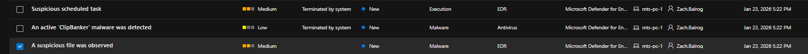
*Defender alert → incident view → memory capture initiation highlighting `syshost.exe`*

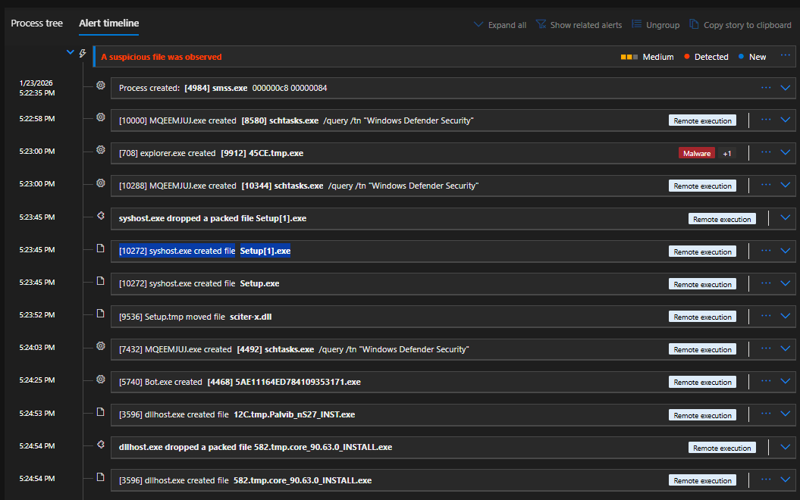
*Defender alert timeline highlighting suspicious process creation events, including `syshost.exe` execution and subsequent file creation consistent with malware staging behavior.*

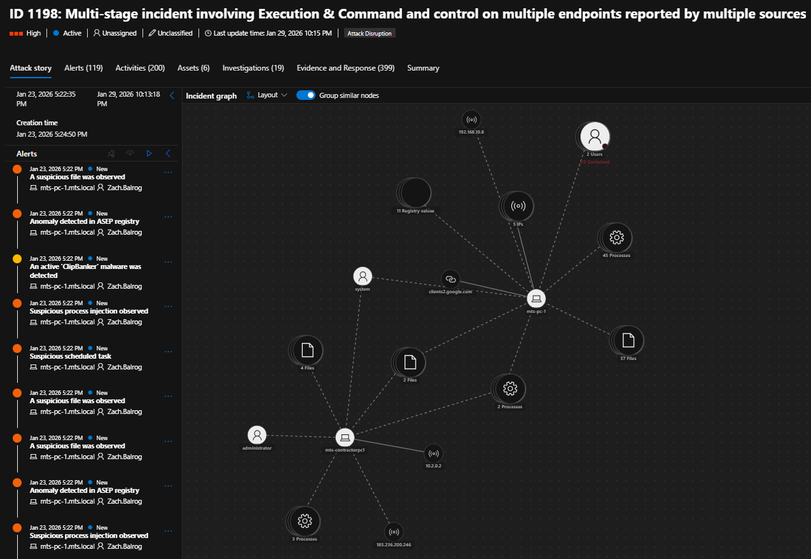
*Defender incident graph visualizing multi-stage activity associated with `MTS-PC-1`, including processes, files, network connections, and registry artifacts correlated to the incident.*

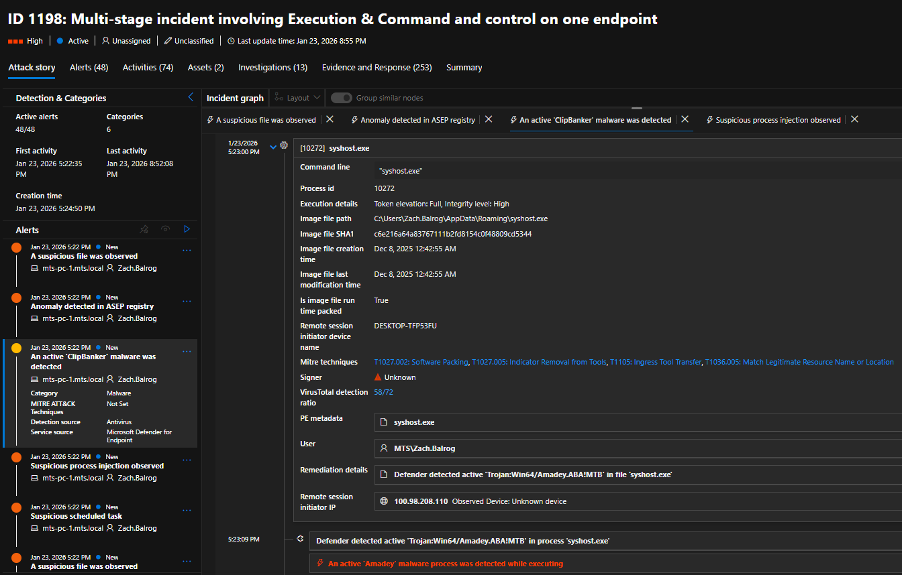
*Detailed process view for `syshost.exe` (PID 10272) showing execution context, file path, elevated integrity level, malware classification, and MITRE ATT&CK technique mapping.*

---

## 2. Preparing the Memory Image (Volatility 3)

The memory image required proper kernel context before analysis could proceed.

> **Analyst Note – Kernel Context Resolution**
> Initial execution of `windows.info.Info` did not fully resolve kernel translation and symbols. Kernel context was captured and saved to `dtb.json`, after which Windows plugins executed normally. All subsequent analysis reused this configuration to ensure reliable address translation.

### Action

The operating system profile and kernel information were identified using:

```bash
vol -f primary.raw windows.info.Info
```

### Outcome

* Windows 10 x64 identified
* Kernel DTB successfully resolved
* Matching symbol files located

A working configuration file (`dtb.json`) was generated and reused for all subsequent commands.

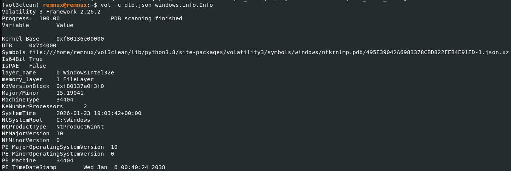
*Volatility 3 `windows.info.Info` output confirming Windows version, kernel base, DTB, and loaded symbols*

---

## 3. Process Enumeration and Validation

To confirm the suspicious process was present in memory:

```bash
vol -c dtb.json windows.pslist.PsList
```

### Outcome

* `syshost.exe` confirmed active at capture time
* PID 10272 validated
* Process suitable for further memory inspection

This confirmed the investigation target and justified deeper analysis.

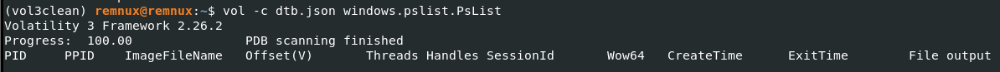
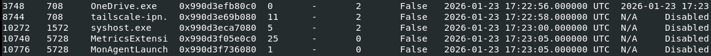
*Process listing output highlighting `syshost.exe` (PID 10272) present at capture time*

---

## 4. Virtual Address Descriptor (VAD) Analysis

The next step was to determine whether the process contained signs of injected or abnormal memory regions.

### Action

```bash
vol -c dtb.json windows.vadinfo.VadInfo --pid 10272
```

### Key Observation

A memory region with **PAGE_EXECUTE_READWRITE (RWX)** permissions was identified.

### Interpretation

RWX memory regions in userland processes are strong indicators of:

* Shellcode injection
* Manual PE mapping
* Reflective loading techniques

This finding significantly increased confidence of malicious in-memory activity.

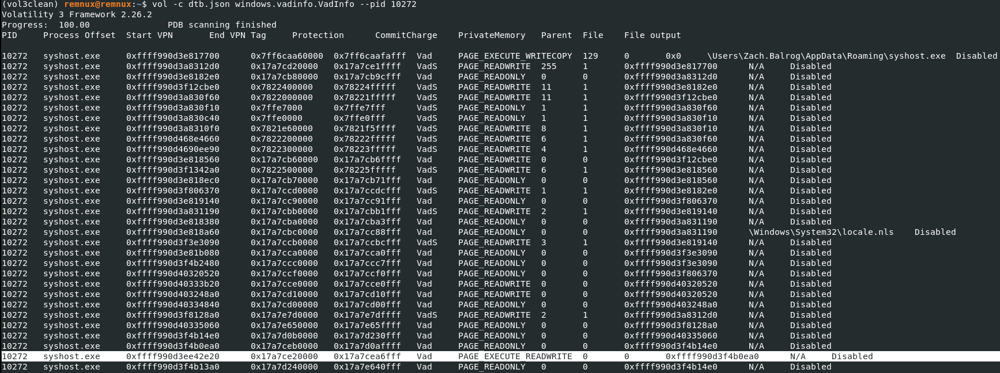
*VAD output showing a PAGE_EXECUTE_READWRITE (RWX) memory region associated with `syshost.exe`*

---

## 5. Process Memory Dumping

To support deeper inspection, full process memory was dumped:

```bash
vol -c dtb.json -o out windows.memmap.Memmap --pid 10272 --dump
```

### Output

* `pid.10272.dmp`
* `pid.10272-1.dmp`

These files represent mapped memory regions for the target process.

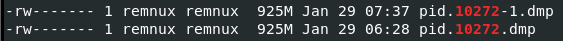
*Directory listing showing generated process memory dump files for PID 10272*

---

## 6. RWX VAD Extraction Attempt (and Limitation)

An attempt was made to directly carve the RWX VAD using file offsets.

### Result

Direct carving failed due to:

* RWX addresses being **virtual addresses**
* Volatility 3 dumps not being VA-linear
* No direct VA → file offset mapping


### Conclusion

This behavior is **expected in Volatility 3** and indicates that traditional byte-offset carving is not viable for this scenario.

The failure itself provided evidence that **address-aware extraction** would be required.


---

## 7. PE Reconstruction Attempt from RWX Memory

To determine whether the RWX region contained a valid PE:

```bash
vol -c dtb.json -o out windows.pedump.PEDump --pid 10272 --base <RWX_START>
```

### Result

* PEDump executed successfully
* No PE was reconstructed

### Interpretation

This strongly suggests the RWX region contained:

* Shellcode
* Loader or staging code
* A manually mapped payload without intact headers

This behavior aligns with **fileless execution techniques**.

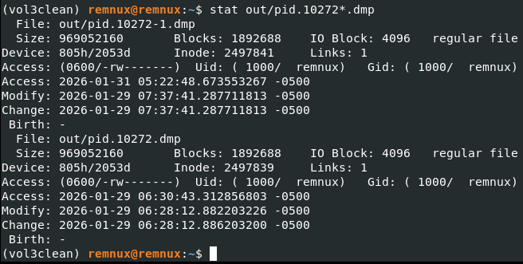

*PEDump execution showing no reconstructable PE within the RWX memory region*

---

## 8. Identification of a Memory-Backed Executable

During analysis, Volatility extracted several ImageSectionObjects. One was associated with the target process:

```
ImageSectionObject.syshost.exe.img
```

This artifact represents an executable mapped into memory rather than loaded from disk.

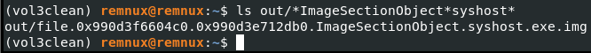
*Extracted ImageSectionObject file associated with `syshost.exe` loaded directly from memory*

---

## 9. Artifact Validation

### File Identification

```bash
file ImageSectionObject.syshost.exe.img
```

**Result:**

```
PE32+ executable (GUI) x86-64, for MS Windows
```

### Hashing

```bash
sha256sum ImageSectionObject.syshost.exe.img
```

This confirmed the presence of a legitimate PE structure existing **only in memory**.

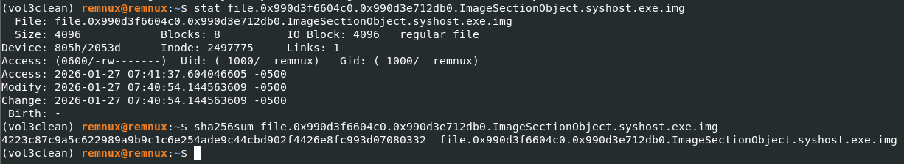
*File type identification and cryptographic hashing of the in-memory PE artifact*

---

## 10. Structural Analysis of the In-Memory PE

The artifact was analyzed using:

```bash
pecheck.py ImageSectionObject.syshost.exe.img
```

### Key Findings

* Valid DOS and NT headers present
* Entry point resolved to a virtual memory address
* Section raw sizes exceeded file size
* Over 90% of file content consisted of null bytes
* Import and relocation structures malformed

### Interpretation

The executable was:

* Not packed or encrypted
* Not disk-backed
* Consistent with a **manually mapped or reflective loader stub**


*`pecheck.py` output highlighting malformed sections and headers consistent with manual PE mapping*

---

## 11. Final Assessment

### What Happened

1. Shellcode was injected into `syshost.exe`
2. RWX memory was allocated
3. A PE was manually mapped into memory
4. Execution occurred without writing the payload to disk

### Why This Matters

This behavior demonstrates:

* Fileless execution
* Evasion of traditional file-based detection
* Advanced post-exploitation tradecraft

---

## 12. Technique Classification

Mapped to MITRE ATT&CK:

* **T1055 – Process Injection**
* **T1620 – Reflective Code Loading**
* **T1106 – Native API Usage**

---

## 13. Key Takeaways

* RWX memory regions are high-confidence indicators of injection
* Volatility 3 requires address-aware extraction techniques
* ImageSectionObjects are often the most reliable artifacts in fileless cases
* Tool limitations can provide investigative insight

---

> *This walkthrough emphasizes investigative reasoning and memory-forensics methodology in a fileless attack scenario.*
