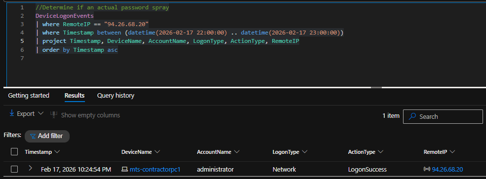
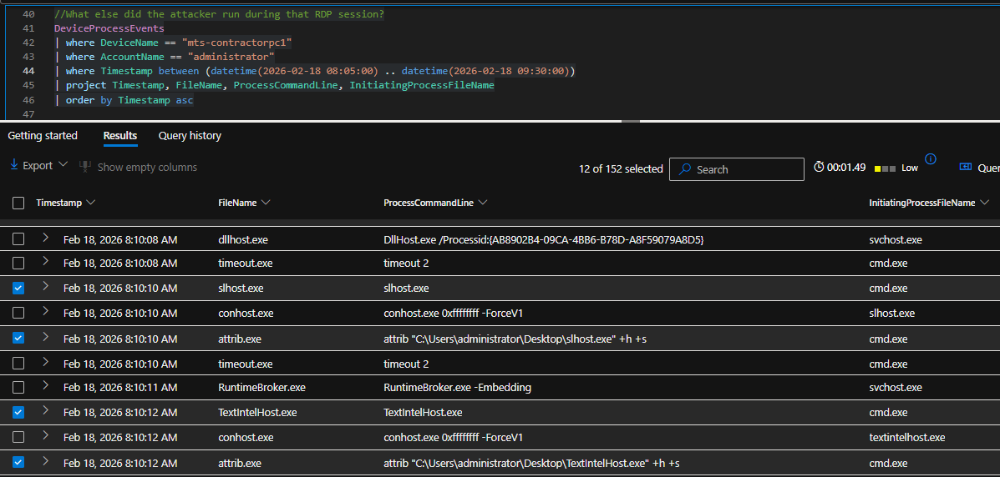
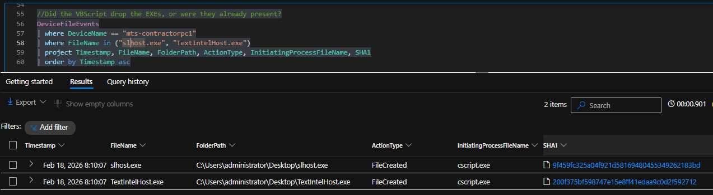
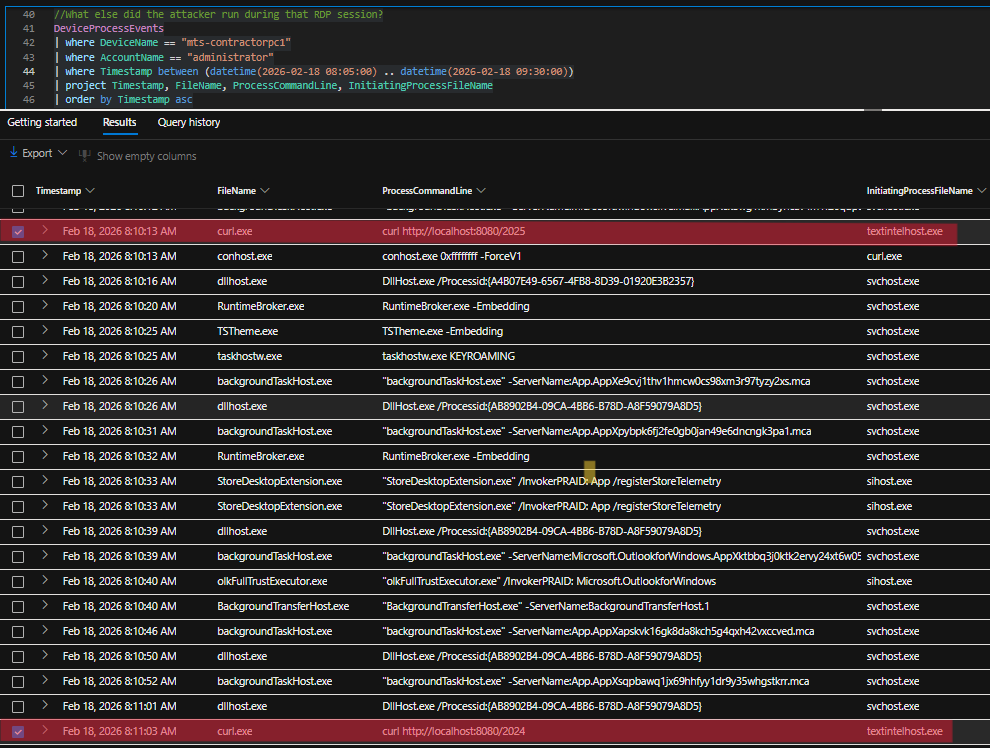
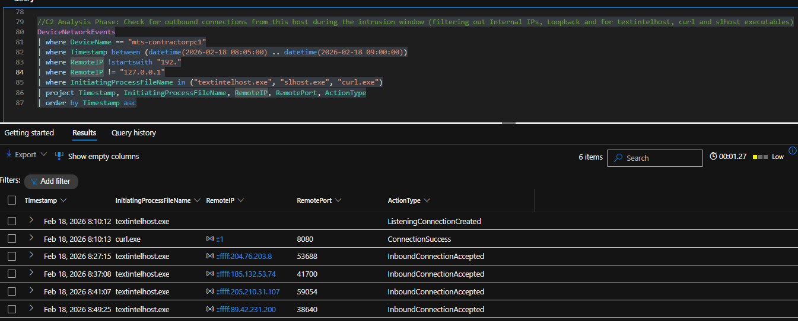

# Investigation Walkthrough  
Password Spray to Bind-Style Backdoor  
Microsoft Defender XDR – Lab Simulation

---

## Step 1 – Alert Detection

The investigation began with a high-severity password spray alert targeting the administrator account.

### Screenshot

**Caption:**  
High-severity password spray alert showing multiple failed authentication attempts followed by a successful login to the administrator account.

---

## Step 2 – Logon Validation

Advanced Hunting confirmed the successful authentication event.

### Screenshot

**Caption:**  
DeviceLogonEvents query confirming successful authentication following multiple failed attempts.

---

## Step 3 – Interactive Access Confirmation

A RemoteInteractive (Logon Type 10) session was observed, indicating hands-on keyboard activity.

### Screenshot

**Caption:**  
RemoteInteractive (RDP) session established using the compromised administrator account.

---

## Step 4 – Execution Chain Analysis

Process tree reconstruction revealed execution of a batch file which staged additional scripts.

### Screenshot

**Caption:**  
Process tree showing explorer.exe spawning cmd.exe to execute s.bat.

---

## Step 5 – Defense Evasion Identified

PowerShell was used to modify Windows Defender settings.

### Screenshot

**Caption:**  
PowerShell command adding a Defender exclusion for the Desktop directory, indicating deliberate security bypass.

---

## Step 6 – Malicious Payload Drop

Two suspicious executables were created and hidden.

### Screenshot

**Caption:**  
DeviceFileEvents showing creation of slhost.exe and textintelhost.exe via cscript.exe.

---

## Step 7 – Backdoor Listener Created

textintelhost.exe opened a TCP listener on port 8080 bound to all interfaces.

### Screenshot

**Caption:**  
ListeningConnectionCreated event confirming TCP 8080 listener bound to :: (all interfaces).

---

## Step 8 – Sustained Inbound Connections

Multiple external IP addresses connected to the exposed listener over several hours.

### Screenshot

**Caption:**  
InboundConnectionAccepted events showing repeated external connections to 192.168.10.11:8080.

---

## Step 9 – Case Closure

The Defender case was updated with findings and marked resolved for lab purposes.

### Screenshot

**Caption:**  
Defender incident updated with confirmed compromise and recommended containment actions.

---

# Final Determination

This investigation confirmed:

- Credential compromise
- Manual payload staging
- Defender tampering
- Bind-style backdoor behavior
- Sustained external access

Compromise confirmed.