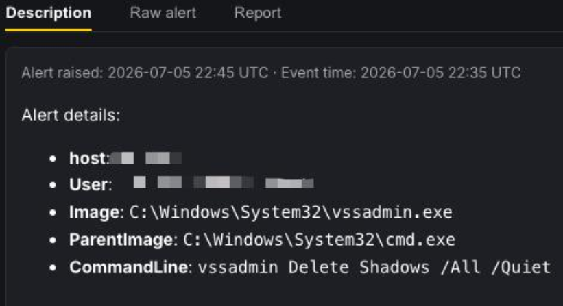
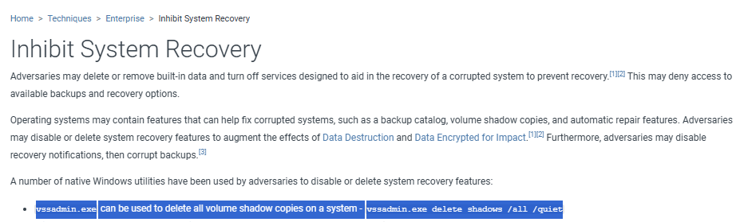
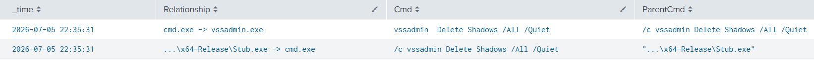
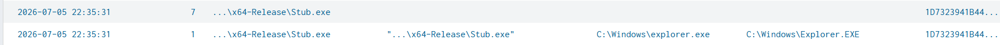
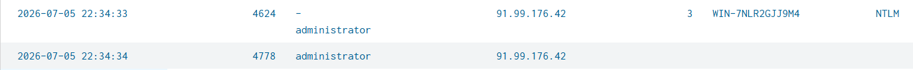
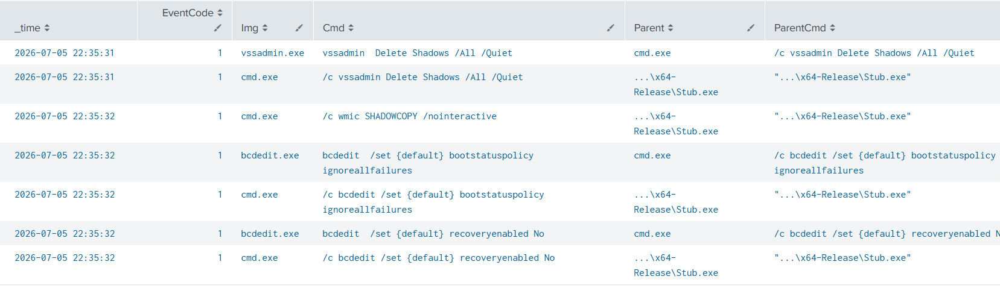
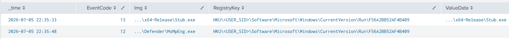
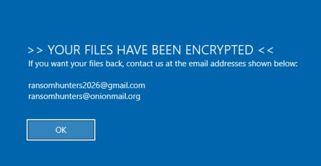

# Walkthrough: KCD Ransomware - Shadow Copy Deletion

## Investigation Goal

The goal of this investigation was to determine whether the shadow copy deletion alert on `KCD-Web` represented true ransomware activity, identify the access path, validate execution and impact, and review whether collection or exfiltration activity was present in the available telemetry.

---

## Screenshot Evidence Guide

Screenshots are included throughout this walkthrough to support the investigation steps and show the analyst workflow from alert review through final determination.

Recommended screenshot folder:

```text
./screenshots/
```

Before adding screenshots to GitHub, screenshots should be cropped to remove browser session URLs, Splunk session links, tokens, credentials, unrelated customer data, or unnecessary raw logs.

Current screenshot naming convention:

```text
01-alert-shadow-copy-deletion.png
02-process-chain-stub-cmd-vssadmin.png
03-stub-exe-payload-path.png
04-suspicious-rdp-access.png
07-user-facing-ransom-note.png
```

---

## 1. Alert Review

The investigation began with a Splunk scheduled detection for shadow copy deletion on `KCD-Web`.

The alert centered on the following command:

`vssadmin Delete Shadows /All /Quiet`

This command is commonly associated with ransomware because it removes Windows shadow copies, reducing the victim's ability to restore files.

**Initial question:**  
Was this a legitimate administrative action or ransomware-related recovery impairment?

### Screenshot Evidence



**What this shows:** The original SOC alert showing `vssadmin Delete Shadows /All /Quiet`, which triggered the ransomware investigation.

---

## 2. Initial ATT&CK Mapping

The first technique considered was:

| Tactic | Technique | Technique ID |
|---|---|---|
| Defense Impairment | Inhibit System Recovery | T1490 |

The alert matched recovery impairment behavior because shadow copies were deleted using `vssadmin`.

MITRE ATT&CK describes `T1490: Inhibit System Recovery` as adversary behavior where built-in recovery features may be disabled or deleted to prevent recovery. The technique specifically includes the use of `vssadmin.exe` to delete volume shadow copies.

### Screenshot Evidence



**What this shows:** The MITRE ATT&CK reference for `T1490: Inhibit System Recovery`, including the use of `vssadmin.exe delete shadows /all /quiet` to delete volume shadow copies. This supports the ATT&CK mapping used for the shadow copy deletion alert.

---

## 3. Process Chain Review

The next pivot was to identify what launched `vssadmin.exe`.

The process chain showed:

`Stub.exe -> cmd.exe -> vssadmin.exe`

This shifted the investigation from a single suspicious command to a likely ransomware execution chain.

**Key finding:**  
`Stub.exe` was the parent process responsible for launching recovery-impairment commands.

### Screenshot Evidence



**What this shows:** The process relationship showing `Stub.exe -> cmd.exe -> vssadmin.exe`, supporting that the shadow copy deletion command was launched by the ransomware payload rather than normal administrative activity.

---

## 4. Payload Review

`Stub.exe` was observed executing from the administrator Documents directory:

`C:\Users\administrator\Documents\2147BE653CE551EC\x64-Release\Stub.exe`

Associated hashes were identified:

| Hash Type | Value |
|---|---|
| SHA256 | `1D7323941B44E77F22DD93701CAE781D330AA26881993B9D2307F1C783AC7CD7` |
| SHA1 | `40BF54C808F2A2F2AEB000480A36CC117839FA4B` |
| MD5 | `829BF5971E4808CB5D8ED52BBA328B59` |

Microsoft Defender later detected the threat as:

`Ransom:Win64/WannaCrypt.PAGV!MTB`

**Conclusion:**  
`Stub.exe` was confirmed as the primary ransomware payload in the reviewed telemetry.

### Screenshot Evidence



**What this shows:** The suspicious `Stub.exe` payload executing from the administrator Documents directory, supporting that this file was the primary ransomware executable in the reviewed telemetry.

---

## 5. Access Path Review

After identifying the payload, the investigation pivoted backward to determine how access may have occurred.

Successful authentication activity was observed from:

`91[.]99[.]176[.]42`

This IP was associated with successful administrator authentication and RDP reconnect activity shortly before `Stub.exe` executed.

A second IP, `91[.]238[.]181[.]47`, showed high-volume RDP failed-authentication activity, but no confirmed successful logon was identified from that source.

**Conclusion:**  
`91[.]99[.]176[.]42` was treated as the confirmed suspicious access IP.  
`91[.]238[.]181[.]47` was treated as a suspicious brute-force/password-guessing source.

### Screenshot Evidence



**What this shows:** Successful administrator authentication and RDP-related access from `91[.]99[.]176[.]42` shortly before `Stub.exe` execution. This supports the likely access path into `KCD-Web` before the ransomware activity began.

---

## 6. Recovery Impairment Review

Multiple recovery-impairment commands were observed after `Stub.exe` execution:

- `vssadmin Delete Shadows /All /Quiet`
- `wmic SHADOWCOPY /nointeractive`
- `bcdedit /set {default} recoveryenabled No`
- `bcdedit /set {default} bootstatuspolicy ignoreallfailures`

These commands indicate an attempt to prevent or weaken system recovery.

**ATT&CK Mapping:**  
Defense Impairment — `T1490: Inhibit System Recovery`

### Screenshot Evidence



**What this shows:** Recovery-disabling commands executed during the ransomware sequence, including shadow copy deletion and Windows recovery configuration changes. The parent process evidence supports that the commands were launched from the `Stub.exe` ransomware chain.

---

## 7. Persistence Review

The investigation then reviewed whether the payload attempted to persist.

`Stub.exe` modified the following Run key:

`HKCU\Software\Microsoft\Windows\CurrentVersion\Run\F56A2BB52AF4B409`

The registry value data pointed back to:

`C:\Users\administrator\Documents\2147BE653CE551EC\x64-Release\Stub.exe`

Microsoft Defender later removed the persistence artifact.

**ATT&CK Mapping:**  
Persistence — `T1547.001: Registry Run Keys / Startup Folder`

### Screenshot Evidence



**What this shows:** `Stub.exe` modified an HKU Run key named `F56A2BB52AF4B409`, with the registry value data pointing back to the ransomware payload. Microsoft Defender later removed the same Run key artifact, supporting both the persistence attempt and remediation.
-->

---

## 8. Impact Review

Ransom note activity was observed shortly after execution.

The ransom note name was:

`DataRecovery.txt`

Ransomware-style encrypted filename artifacts were also observed with the pattern:

`.[ransomhunters2026[at]gmail[.]com].fDKuxNIx`

These artifacts support ransomware impact, although the exact original encrypted file paths were not identified in the reviewed telemetry.

**ATT&CK Mapping:**  
Impact — `T1486: Data Encrypted for Impact`

### Screenshot Evidence



**What this shows:** The ransom note message the user would have seen, supporting ransomware impact and confirming that the activity went beyond recovery impairment.

---

## 9. Defender Detection and Quarantine

Microsoft Defender detected and quarantined the malware associated with `Stub.exe`.

Detection name:

`Ransom:Win64/WannaCrypt.PAGV!MTB`

This supported the final determination that the alert was not just suspicious administrative activity, but confirmed ransomware activity.

### Screenshot Evidence


**What this shows:** Microsoft Defender detected the malware as `Ransom:Win64/WannaCrypt.PAGV!MTB` and quarantined the threat. The detection details also tie the activity to `Stub.exe` and the related Run key artifact, supporting the final ransomware determination.

---

## 10. Collection and Exfiltration Review

The investigation reviewed for evidence of collection, staging, upload tooling, suspicious outbound traffic, and secondary remote access tooling.

The review included searches for:

- Archive utilities
- File staging behavior
- Common exfiltration tools
- Suspicious outbound network traffic
- RMM and secondary remote access tools

No confirmed attacker-controlled archive creation, data staging, exfiltration tooling, suspicious outbound traffic, or secondary remote access tooling was identified in the reviewed telemetry.

**Conclusion:**  
Collection and exfiltration were reviewed but not confirmed.

<!-- Optional future screenshot:
### Screenshot Evidence


**What this shows:** Searches supporting that collection and exfiltration were reviewed but not confirmed.
-->

---

## 11. Final Timeline Review

After validating the major pivots, the final timeline showed the ransomware sequence in order:

1. Suspicious administrator/RDP access from `91[.]99[.]176[.]42`
2. `Stub.exe` creation and execution
3. Shadow copy deletion and recovery impairment
4. Run key persistence attempt
5. Ransom note creation
6. Defender detection and quarantine
7. Encrypted filename artifacts observed

<!-- Optional future screenshot:
### Screenshot Evidence


**What this shows:** The final ordered timeline of suspicious access, payload execution, recovery impairment, impact, and Defender response.
-->

---

## 12. Final Determination

This alert was determined to be a true positive ransomware event.

The strongest evidence included:

- Suspicious administrator/RDP access from `91[.]99[.]176[.]42`
- Execution of `Stub.exe`
- Shadow copy deletion with `vssadmin`
- Additional recovery impairment using `wmic` and `bcdedit`
- Run key persistence attempt
- Ransom note deployment
- Encrypted filename artifacts
- Defender detection and quarantine as `Ransom:Win64/WannaCrypt.PAGV!MTB`

## Final Classification

**True Positive - Ransomware Activity Confirmed**

---

## Lessons Learned

- Shadow copy deletion should be treated as high-priority when tied to suspicious parent processes.
- Process ancestry is critical for separating legitimate administrative activity from ransomware behavior.
- Successful logon activity immediately before payload execution can help identify the likely access path.
- Recovery impairment, persistence, ransom notes, and encrypted filename artifacts together provide strong evidence of ransomware impact.
- Collection and exfiltration should be reviewed separately and not assumed without supporting evidence.