# Walkthrough: KCD-Web Nemesys Ransomware

## Investigation Goal

The goal of this investigation was to determine whether the ransomware activity observed on `KCD-Web` represented a true ransomware incident, validate whether file encryption occurred, identify the responsible process, determine how the attacker gained access, review credential-access and defense-impairment activity, and scope the environment for additional affected systems.

---

## Screenshot Evidence Guide

Screenshots are included throughout this walkthrough to support the investigation steps and show the analyst workflow from the initial ransomware alert through final determination.

---

## 1. Alert Review

The investigation began after a ransomware note was identified on `KCD-Web`.

The note stated:

`All your files have been encrypted!`

The message demanded payment in Bitcoin and provided instructions for contacting the attacker to recover encrypted files.

This immediately suggested ransomware impact activity.

**Initial question:**  
Were files actually encrypted, and what process was responsible for the ransomware activity?

### Screenshot Evidence

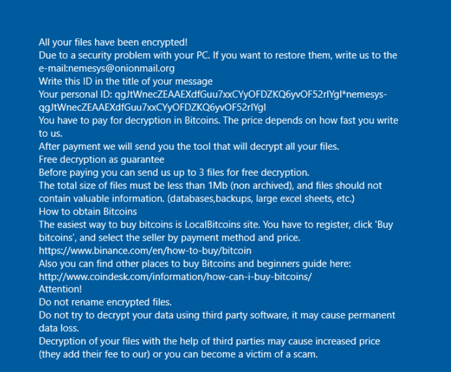

**What this shows:** The user-facing ransomware message claiming that files on the system had been encrypted and demanding payment for decryption.

---

## 2. Initial ATT&CK Mapping

Based on the ransom note, the first technique considered was:

| Tactic | Technique | Technique ID |
|---|---|---|
| Impact | Data Encrypted for Impact | T1486 |

The ransom note strongly suggested `T1486: Data Encrypted for Impact`.

However, the ransom note alone did not prove that widespread file encryption successfully occurred.

For that reason, T1486 was initially treated as **suspected** rather than confirmed.

### Investigation Pivot

Because the investigation began near the end of the attack chain, the next step was to work backward.

**Next question:**  
What process created or displayed the ransom note?

### Screenshot Evidence

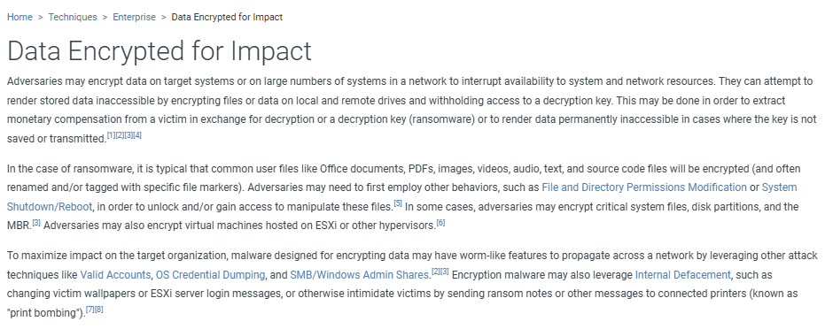

**What this shows:** The MITRE ATT&CK reference for `T1486: Data Encrypted for Impact`, which provided the initial behavioral starting point for the investigation.

---

## 3. Ransom Note Process Review

The investigation searched endpoint telemetry for:

`Info_to_decrypt_nemesys.txt`

At approximately `18:14:56 UTC`, `notepad.exe` opened:

`C:\Info_to_decrypt_nemesys.txt`

Suspicious `nemesys.exe` activity was observed during the same execution window.

This provided the first process-level pivot away from the ransom note.

**Key finding:**  
`nemesys.exe` became the primary executable of interest.

### Screenshot Evidence

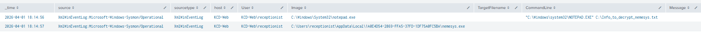

**What this shows:** Endpoint telemetry showing `Info_to_decrypt_nemesys.txt` being opened during the `nemesys.exe` activity window.

---

## 4. Nemesys Execution Review

The investigation pivoted to `nemesys.exe` to determine whether the executable was actually launched.

At approximately `18:14:42 UTC`, the following process relationship was identified:

`explorer.exe -> nemesys.exe`

The executable was launched from:

`C:\Users\receptionist\Videos\nemesys.exe`

under:

`KCD-Web\receptionist`

**Key finding:**  
`nemesys.exe` was executed within the receptionist user's interactive session.

### Screenshot Evidence

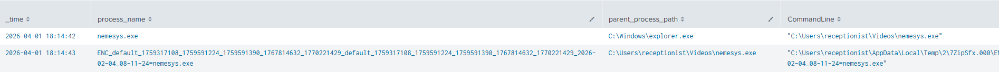

**What this shows:** Process creation telemetry showing `explorer.exe` launching `C:\Users\receptionist\Videos\nemesys.exe` at `18:14:42 UTC`. One second later, `nemesys.exe` launched an additional Nemesys-related executable from the `7ZipSfx.000` temporary directory, providing the next pivot into the ransomware execution chain.

### Additional Execution Chain Evidence

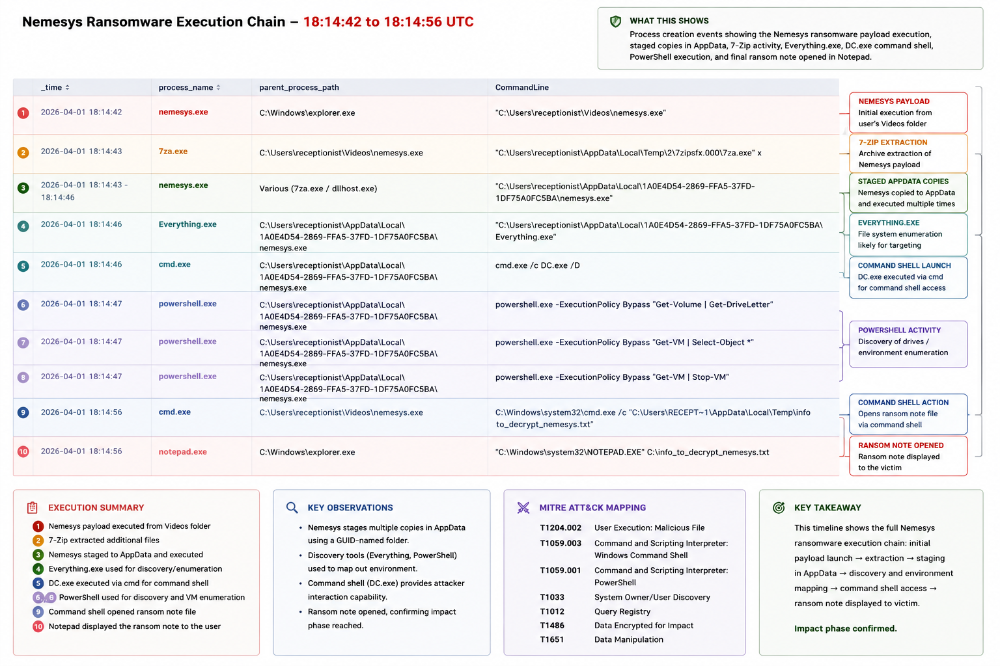

**What this shows:** The earliest observed Sysmon process creation event for `nemesys.exe` at `18:14:42 UTC`, followed by the immediate execution chain involving the extracted Nemesys payload, `7za.exe`, staged AppData copies of `nemesys.exe`, `Everything.exe`, `DC.exe`, PowerShell, and command-shell activity. This broader view shows how quickly the ransomware transitioned from initial execution into payload extraction, staging, discovery, and defense-impairment activity.

**Next pivot:**  
What happened before `18:14:42 UTC` that could explain how the ransomware was staged or what attacker activity preceded execution?

---

## 5. Pre-Execution Activity Review

After confirming ransomware execution, the investigation pivoted backward from `18:14:42 UTC`.

The objective was to determine:

**What happened immediately before Nemesys executed?**

Approximately two minutes earlier, suspicious files appeared under:

`C:\Users\receptionist\Videos\automim1\`

The directory contained credential-access tooling including:

- Mimikatz
- LaZagne
- `mimidrv.sys`
- `miparser.vbs`
- supporting scripts and output directories

This significantly expanded the investigation beyond ransomware execution.

**Key finding:**  
Credential-access activity preceded `nemesys.exe` execution and provided the next major investigation pivot.

### Screenshot Evidence

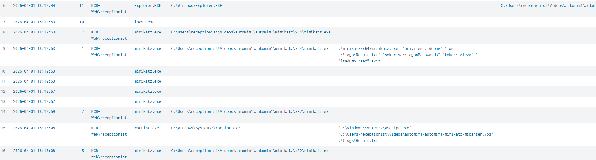

**What this shows:** Endpoint telemetry showing Mimikatz execution from the `automim1` directory at `18:12:53 UTC`, followed by `miparser.vbs` processing the resulting credential output at `18:13:08 UTC`. Both occurred before the first observed Nemesys execution at `18:14:42 UTC`.

**Next question:**  
What was Mimikatz attempting to access, and was credential dumping actually performed?

---

## 6. Mimikatz Execution Review

Finding Mimikatz on disk did not prove it had been executed.

The investigation therefore searched for process creation involving `mimikatz.exe`.

At `18:12:53 UTC`, Mimikatz executed with:

`privilege::debug`

`sekurlsa::logonPasswords`

`token::elevate`

`lsadump::sam`

Output was written to:

`.\!logs\Result.txt`

**ATT&CK Mapping:**  
Credential Access — `T1003.001: OS Credential Dumping: LSASS Memory`  
Credential Access — `T1003.002: OS Credential Dumping: Security Account Manager`

**Key finding:**  
Credential dumping was confirmed rather than merely attempted through tool staging.

### Screenshot Evidence

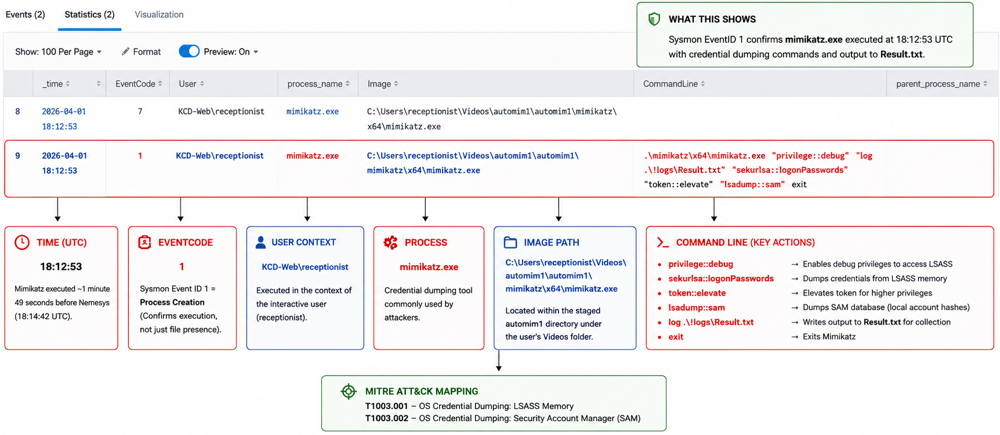

**What this shows:** Sysmon process creation telemetry showing Mimikatz executing `privilege::debug`, `sekurlsa::logonPasswords`, `token::elevate`, and `lsadump::sam`.

---

## 7. Credential Output Review

The investigation followed the Mimikatz output to determine what happened after credentials were dumped.

`Result.txt` was processed using:

`miparser.vbs`

Shortly afterward:

- `Passwords.txt` was opened
- `NTLM.txt` was opened
- `Result.txt` was opened

The files were viewed using `notepad.exe`.

**Key finding:**  
Credential information was not only dumped but subsequently parsed and reviewed.

### Screenshot Evidence

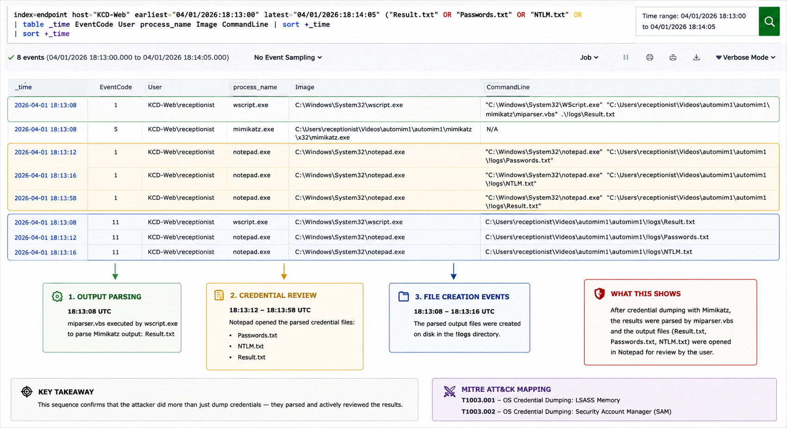

**What this shows:** Endpoint telemetry showing `miparser.vbs` processing the Mimikatz `Result.txt` output, followed by `Passwords.txt`, `NTLM.txt`, and `Result.txt` being opened with Notepad. This supports that the credential dump results were parsed and interactively reviewed.

---

## 8. Access Path Review

With credential-access activity confirmed, the investigation moved further backward to determine how the attacker initially accessed `KCD-Web`.

Authentication telemetry showed repeated failed logon attempts involving the `receptionist` account.

Suspicious authentication activity associated with:

`141[.]98[.]83[.]86`

was identified before the credential-access and ransomware activity.

**ATT&CK Mapping:**  
Initial Access — `T1110: Brute Force`  
Initial Access — `T1078: Valid Accounts`

**Key finding:**  
The authentication activity supported a suspected brute-force/valid-account access path involving the receptionist account.

### Screenshot Evidence

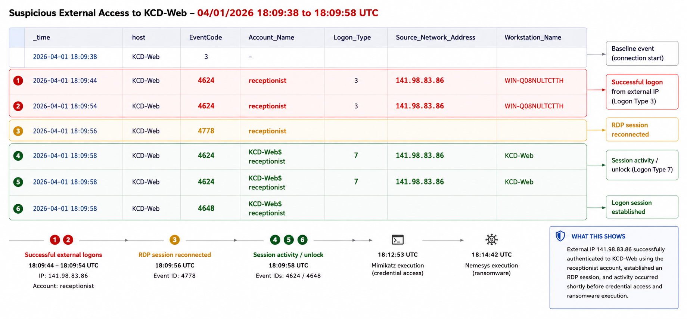

**What this shows:** Failed and successful authentication activity reviewed to establish the suspected access path before attacker tooling appeared.

---

## 9. Payload Extraction and Staging Review

After reconstructing the earlier attack path, the investigation returned to the Nemesys execution chain.

`7za.exe` was executed from:

`C:\Users\receptionist\AppData\Local\Temp\2\7ZipSfx.000\`

Additional ransomware components were staged within:

`C:\Users\receptionist\AppData\Local\1A0E4D54-2869-FFA5-37FD-1DF75A0FC5BA\`

Notable files included:

- `nemesys.exe`
- `DC.exe`
- `Everything.exe`

**Key finding:**  
Nemesys extracted and staged supporting components within a randomly named AppData working directory.

### Screenshot Evidence

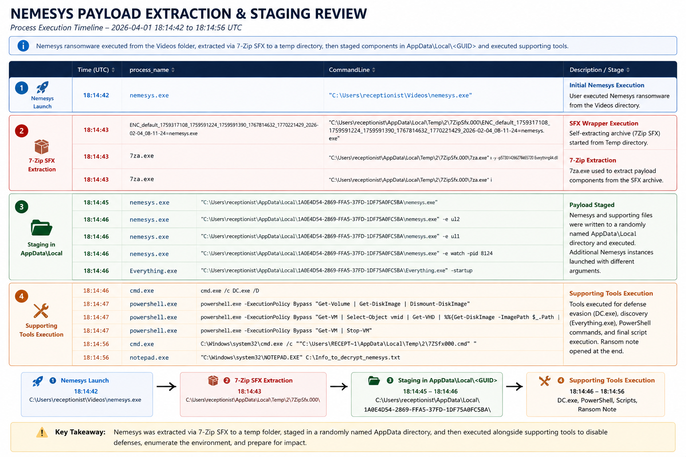

**What this shows:** Process and file telemetry showing `7za.exe` extraction and ransomware components staged within the AppData working directory.

---

## 10. Persistence Review

The investigation reviewed registry activity associated with `nemesys.exe`.

A Registry Run entry was created under the receptionist user's hive.

**ATT&CK Mapping:**  
Persistence — `T1547.001: Registry Run Keys / Startup Folder`

**Key finding:**  
Nemesys established a mechanism to execute again when the user logged on.

### Screenshot Evidence

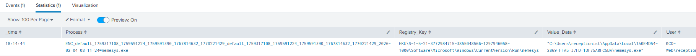

**What this shows:** Registry telemetry showing the Run key created by `nemesys.exe`.

---

## 11. File Discovery Review

Nemesys launched:

`Everything.exe -startup`

Everything is capable of rapidly indexing files and directories on Windows systems.

Within the context of the ransomware execution chain, this activity was consistent with file discovery before impact activity.

**ATT&CK Mapping:**  
Discovery — `T1083: File and Directory Discovery`

### Screenshot Evidence

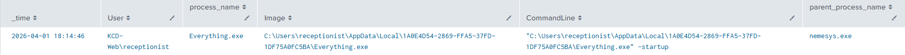

**What this shows:** Process telemetry showing Nemesys launching `Everything.exe -startup` from the ransomware staging directory.

---

## 12. Defender Impairment Review

The investigation identified:

`cmd.exe /c DC.exe /D`

`DC.exe` modified:

`HKLM\SOFTWARE\Policies\Microsoft\Windows Defender\DisableAntiSpyware`

The value was set to:

`DWORD 1`

Later, `DC.exe` executed as:

`NT AUTHORITY\SYSTEM`

using:

`DC.exe /SYS 1`

**ATT&CK Mapping:**  
Defense Impairment — `T1562.001: Impair Defenses`

**Key finding:**  
The ransomware toolchain deliberately attempted to impair Microsoft Defender and later executed the defense-impairment tool under SYSTEM privileges.

### Screenshot Evidence

**What this shows:** Registry and process telemetry showing Defender policy modification and subsequent SYSTEM-level `DC.exe` execution.

---

## 13. IFEO Process Interference Review

Nemesys created numerous Image File Execution Options `Debugger` registry modifications.

Targets included processes associated with:

- Sysmon
- Task Manager
- PerfMon
- SQL Server
- Veeam
- shutdown
- logoff

The targeted applications included security, administrative, database, and backup-related processes.

**ATT&CK Mapping:**  
Persistence — `T1546.012: Image File Execution Options Injection`

### Screenshot Evidence

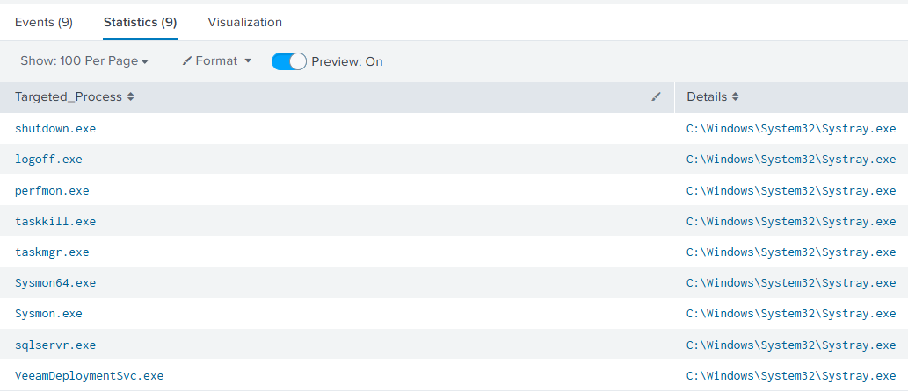

**What this shows:** Registry telemetry showing Nemesys creating IFEO Debugger entries targeting monitoring, administrative, database, and backup-related executables.

---

## 14. Recovery and VM Disruption Review

PowerShell activity associated with Nemesys included commands designed to:

- Dismount disk images
- Enumerate virtual machine disks
- Stop virtual machines

VSS-related configuration changes were also identified.

**ATT&CK Mapping:**  
Impact — `T1490: Inhibit System Recovery`

**Key finding:**  
The ransomware attempted to interfere with resources that could support recovery or remain inaccessible during encryption.

### Screenshot Evidence

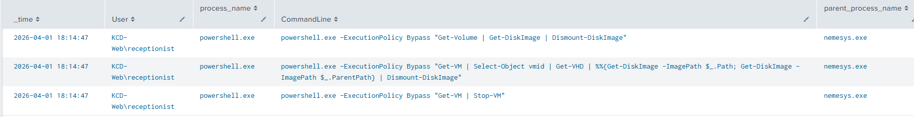

**What this shows:** PowerShell activity launched during the Nemesys execution chain to dismount disk images and stop virtual machines.

---

## 15. Impact Validation

The investigation returned to the original question:

**Were files actually encrypted?**

Endpoint telemetry was reviewed for:

- Mass file creation
- File deletion
- File renaming
- New ransomware extensions
- High-volume writes from `nemesys.exe`
- Activity within user and shared directories

The ransom note and ransomware execution were confirmed.

However, the available telemetry did not provide sufficient file-write, rename, or extension-change evidence to conclusively demonstrate widespread encryption.

**Conclusion:**  
Ransomware activity was confirmed, but widespread file encryption was not conclusively demonstrated in the reviewed telemetry.

### Screenshot Evidence

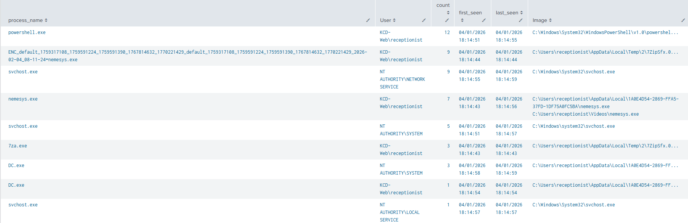

**What this shows:** Endpoint file telemetry reviewed to determine whether widespread encryption could be independently confirmed.

---

## 16. Enterprise Scoping

The investigation expanded beyond `KCD-Web` to determine whether related activity occurred elsewhere.

Scoping included behavioral indicators such as:

- Mimikatz execution
- `sekurlsa::logonPasswords`
- `DC.exe`
- `DisableAntiSpyware`
- `Everything.exe`
- `Info_to_decrypt_nemesys.txt`
- IFEO modifications
- `7ZipSfx.000`

The search window was expanded beyond April 1 so the investigation did not depend solely on the original event date.

**Conclusion:**  
The strongest combination of credential access, ransomware execution, discovery, and defense impairment remained concentrated on `KCD-Web`. No definitive evidence of Nemesys propagation to additional hosts was identified.

### Screenshot Evidence

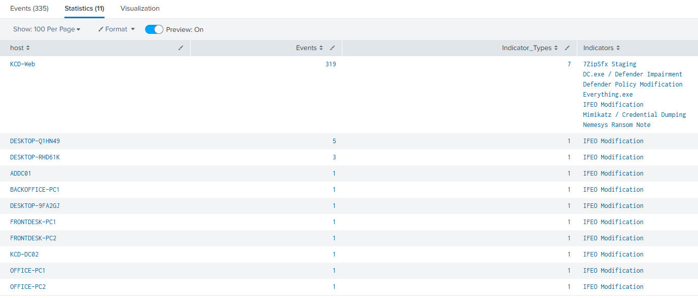

**What this shows:** Environment-wide behavioral scoping used to determine whether the Nemesys toolchain appeared on additional endpoints.

---

## 17. Final Timeline Review

After validating the major pivots, the investigation reconstructed the activity:

1. Suspicious authentication activity against `KCD-Web`
2. `automim1` toolkit staged
3. Mimikatz and LaZagne credential access
4. Credential results parsed and reviewed
5. `nemesys.exe` executed
6. Supporting components extracted
7. Registry persistence established
8. `Everything.exe` launched for file discovery
9. Defender impairment initiated
10. IFEO process interference performed
11. Recovery and VM disruption attempted
12. `DC.exe` executed as SYSTEM
13. Nemesys ransom note displayed
14. Impact investigated
15. Environment scoped for additional compromise

### Screenshot Evidence

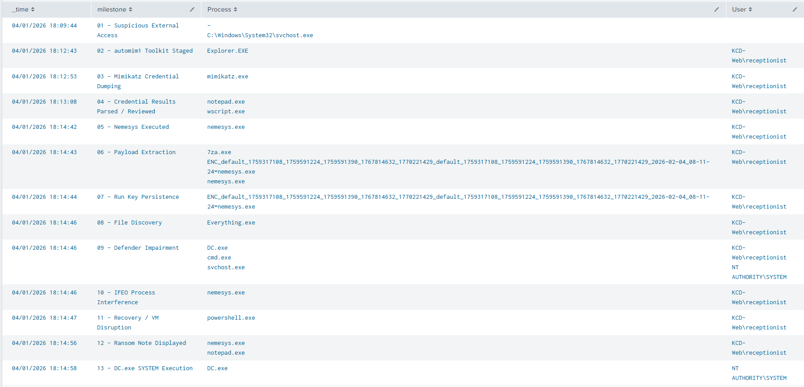

**What this shows:** The reconstructed attack sequence from suspected initial access through credential dumping, ransomware execution, defense impairment, and impact.

---

## 18. Final Determination

This investigation was determined to be a true positive ransomware incident.

The strongest evidence included:

- Suspicious authentication preceding malicious activity
- `automim1` credential-access toolkit staging
- Confirmed Mimikatz execution
- LaZagne and registry-hive credential access
- Credential output parsing and review
- `nemesys.exe` execution
- Registry Run persistence
- `Everything.exe` file discovery
- Microsoft Defender impairment
- SYSTEM-level `DC.exe` execution
- IFEO process interference
- Recovery and VM disruption
- Nemesys ransom-note deployment

Widespread file encryption was **not conclusively confirmed** from the available endpoint telemetry and was documented as an investigative limitation rather than assumed.

## Final Classification

**True Positive - Ransomware Activity Confirmed**

---

## Lessons Learned

- An alert can begin at the end of the attack chain; ATT&CK can help determine which direction to pivot.
- A ransom note supports suspected ransomware impact but does not independently prove successful file encryption.
- Process ancestry helps move from a visible impact artifact back toward the responsible executable.
- Finding credential-access tools on disk does not prove execution; process telemetry should be used to validate use.
- Credential-dumping investigations should follow the resulting output to determine what happened after collection.
- SYSTEM-level activity should be validated through execution context rather than assumed from surrounding events.
- Behavioral scoping is stronger than relying only on exact filenames, hashes, or IP addresses.
- Investigation conclusions should distinguish between what was confirmed, what was strongly supported, and what could not be proven from available telemetry.